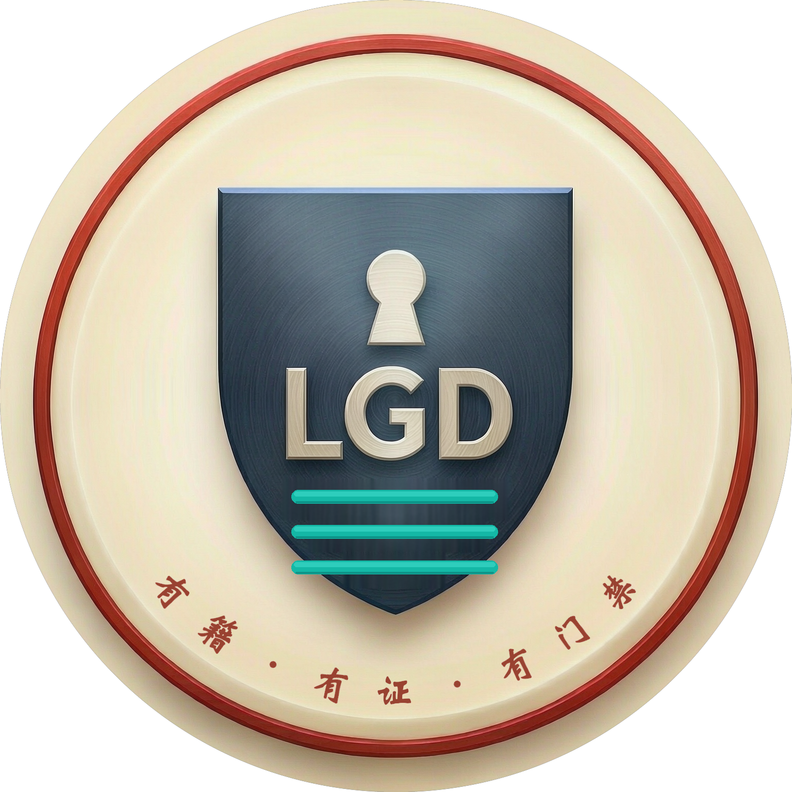

> **品牌归属**：本技能隶属 **LGD「凡自治之物」** 治理理论线，采用**终版头像**（3D 金属红环 + 藏青盾 + LGD 字标 + 三律横杠 + 下弧铭文"有籍·有证·有门禁"，新魏体，1536×1536，永久定版）。
> 同步挂载官方徽记「三律之盾」[lgd-shield-color.svg](lgd-shield-color.svg)（徽章程序 v1.0 · 母本 = LGD 项目号头像 B 系统化）。
> 头像与徽记 © SynomosAI 2026；理论 CC BY 4.0（DOI 10.5281/zenodo.22456647）。参照声明须回链：[LGD-theory](https://github.com/zhaoxinghua09-cell/lgd-theory）。

# agent-evolution · 能力进化飞轮

让 AI 集团公司的每一位数字员工"干一单、强一点"。本技能是「训-战-省-化」飞轮的**第④步（化/Solidify）**，也可端到端跑 ③+④（复盘+固化）。

## 何时用
- 用户说「复盘一下」「把这个经验沉淀」「XX 席进化一下」「固化经验」
- 某席完成一单重要任务后，老二主动调用来升级该席
- 发现一个可复用的流程/避坑/外部源/用户偏好，想永久记住

## 输入
- `agent`（必填）：席别名，如 `medical-device-reg-expert` / `cfo` / `chairman-twin`
- `context`（可选）：本次工作上下文——产物路径、对话摘要、用户反馈

## 流程（严格按顺序）

### 1. 读取该席现状
- 读专家定义：`~/.workbuddy/plugins/marketplaces/my-experts/plugins/<agent>/agents/<agent>.md`（确认基线能力、skills 字段）
- 读作战室能力卡：`<你的工作区根>/作战室能力卡.md` 第六节，定位该席行，看「本周学习重点」与「进化记录」

### 2. 提取可复用经验（从 context + 本次工具调用）
聚焦四类：
- **避坑**：踩过的错、失败路径、工具限制（如"飞书官方连接器 OAuth 无权限，改 webhook 直推"）
- **流程**：多步可复用操作（如"资料库 HTML 导入须带 .html 后缀"）
- **外部源**：核实过的权威链接/官方入口
- **用户偏好/反馈**：Steven 的纠正与认可（如"对外邮件每次需确认闸门""真实照片优先于 AI 生成"）

### 3. 判定沉淀类型
- **动作型**（可复用的流程/脚本/多步操作/带参数的调用）→ 写成**技能**
- **信息型**（事实/偏好/项目约定/数据）→ 写成**记忆**
- 一条经验可能两者皆有：流程写技能、配套事实写记忆

### 4. 执行固化
- **技能**：`SkillManage` 创建（新）或修改（补充已有）。用户级存 `~/.workbuddy/skills/`，项目级存 `{workspace}/.workbuddy/skills/`。默认用户级，除非用户指定项目级。
  - 创建前若技能涉及安装/外部获取，先跑 `skills-security-check` 审计
  - **Fallback（2026-08-26 实战）**：若 SkillManage 工具经 ToolSearch 检索不到 schema 而无法调用，可直接用 Write 创建 `~/.workbuddy/skills/<name>/SKILL.md` 文件（先 mkdir -p 目录），等效且更稳；frontmatter 必带 name/description/version/agent_created: true/author/license/category/platforms/read_when/tags，正文末尾附「版权与许可」段（©+MIT+免责）
- **记忆**：
  - 跨项目用户偏好 → `~/.workbuddy/MEMORY.md`
  - 项目约定/长期事实 → `<你的工作区根>/.workbuddy/memory/MEMORY.md`
  - 当日流水 → `<你的工作区根>/.workbuddy/memory/YYYY-MM-DD.md`

### 5. 回写能力卡进化记录
- Edit 作战室第六节该席行的「进化记录」栏，填本次沉淀摘要，格式：
  `[日期] 沉淀：<技能名/记忆主题> — <该席能力如何升级>`
- 若学习重点已掌握，可在同栏标注「✅本周学习重点已内化」

### 6. 回报用户（简洁）
- 沉淀了什么（技能 X / 记忆 Y）
- 该席能力如何升级（下次遇见同类任务会自动更强）
- 外部动作（如发邮件/发群）若需执行，先列明再等用户确认

## 自评防注水与完成度纪律（v1.1，进化周实战固化）

复盘/自评/固化场景里高频踩的两个坑，处理前先自查：

### ① 自评分必须锚定证据，数值由人校准
- **现象**：让模型自评「进步了多少」，模型倾向给乐观分（实例：本地模型自评 58，人工按证据校准 ≈52；08-24 同现模型乐观偏差）——自评注水会让进化假象化。
- **纪律**：① 本地小模型只做「辅助打分 + 一句话理由」的配角（省积分，零积分铁律延伸）；② 最终数值分由**人工按证据核算**（笔记数/测试通过率/产出清单/索引块数等可验证物），分数必须能对到证据；③ 打分 Prompt 显式写「实事求是不注水（防 Goodhart）」。
- **推广**：适用于所有「AI 给自己/团队打分、报进度」场景（能力自评、周报、复盘、KPI 汇报）。

### ② 标记「完成」前先定义可验证的完成标准（DoD）
- **现象**：任务标记 ✅ 但实际只是「写了文档」（实例：进化周 D3 标 ✅，月后发现核心标准 KERI/C2PA 仍"待精读"；08-20 整站改版只改一半同源）——表面完成比没做更危险（占住进度位）。
- **纪律**：① 建任务时同步写 DoD（如学习任务 = 原文精读 + 笔记 + 输出三要素齐）；② 复盘时抽查「✅ 标记」的验收物，不只是看有没有文件；③ 发现表面完成 → 回滚标记 + 登记补课，不静默放行。

## 红线
- 不臆造经验；没确凿证据的下结论
- 敏感信息（token/密钥/邮箱密码）脱敏，不写进技能/记忆正文
- 涉及真实对外写操作（邮件/文档/跨账号）必须用户确认
- 技能只装 P2 安全级；社区技能先审计

## 示例
用户：「注册专家刚把 8 枢纽导入资料库，复盘一下」
→ 读注册专家定义 + 作战室卡 → 提取"import_html 须带 .html 后缀 / connect_open_platform 换票 1800s 有效期 / 8 枢纽无外链图片满足资料库硬门" → 判定动作型 → SkillManage 建 `kdocs-hub-migrate` 技能 → 回写进化记录 → 回报。
